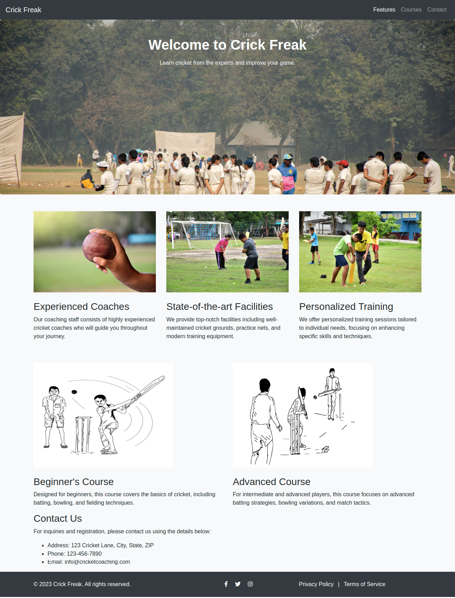
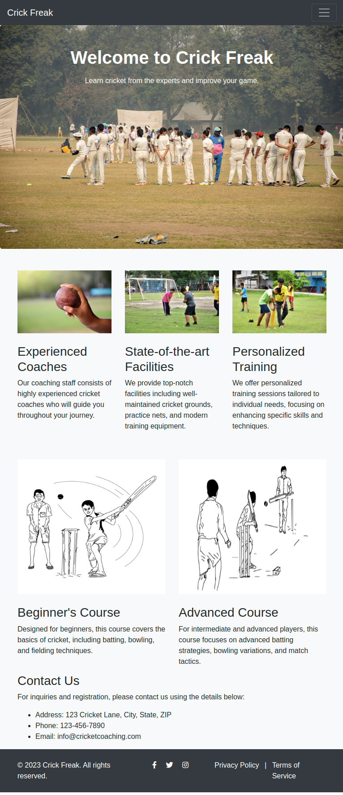
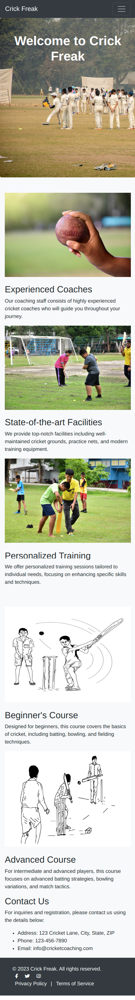

# Crick-Freak-webpage-using-bootstrap
Responsive Web Page Using Bootstrap
## Assessment 1: Develop a Responsive Web Page Using Bootstrap

This assessment is based on the following 3 prints of the HTML courses: Building responsive web pages using HTML5 and CSS3.

- Sprint-1: Structure a web page using CSS Floats
- Sprint-2: Develop a responsive web page using Modern CSS
- Sprint-3: Develop a responsive web page using Bootstrap

## Context

Crick Freak, a cricket coaching institute, want a responsive webpage for showcasing their features, coaching abilities, and contact details. They have reached out to your web design team to develop their webpage. As part of the team, you have been assigned to create the responsive web page. 

## Problem Statement

Develop a responsive web page for Crick Freak using Bootstrap framework.

#### The expected output for Crick Freak should resemble the following images

**Desktop View**



**Tab View**



**Mobile View**



#### Details

**Text used in the web page are as follows**

```
Welcome to Crick Freak

Learn cricket from the experts and improve your game.

Experienced Coaches

Our coaching staff consists of highly experienced cricket coaches who will guide you throughout your journey.

State-of-the-art Facilities

We provide top-notch facilities including well-maintained cricket grounds, practice nets, and modern training equipment

Personalized Training

We offer personalized training sessions tailored to individual needs, focusing on enhancing specific skills and techniques.

Beginner's Course

Designed for beginners, this course covers the basics of cricket, including batting, bowling, and fielding techniques.

Advanced Course

For intermediate and advanced players, this course focuses on advanced batting strategies, bowling variations, and match tactics.

Contact Us
For inquiries and registration, please contact us using the details below:

Address: 123 Cricket Lane, City, State, ZIP
Phone: 123-456-7890
Email: info@cricketcoaching.com

© 2023 Crick Freak. All rights reserved.
Privacy Policy | Terms of Service
